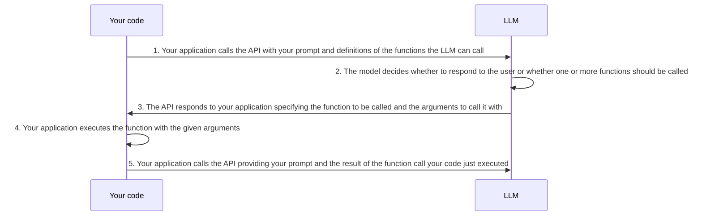

# Write a langchain4j Assistant

## Context and Problem Statement

The langchain4j library provides [`Aiservices`](https://docs.langchain4j.dev/tutorials/ai-services/) which can simplify the creation of a chat assistant. The assistant can take care of managing chat history. content retrieval, and using the model.

The interaction provided by langchain4j is:

For SchemaCrawler, Step #5 is problematic, since the function results can be shared with LLM. SchemaCrawler function results can leak information about the details of the database schema, and so SchemaCrawler need to provide the results directly to the user or caller.

SchemaCrawler uses retrieval augmented generation to retrieve table metadata which are likely to help with the user's prompt. Ideally, this background information should go into a system message to the LLM. Since content retrieval is managed by the langchain4j assistant, content is output into the user message, not the system message. This is another issue with using the assistant. 

Also, the langchain4j API forces the creation of tool executors ahead of time, which limits the ability to make decisions on how to execute functions based on a changed context.

## Considered Options

- Create two assistants depending on whether the user chose to share metadata with the LLM or not. This open was rejected since the code to create a single assistant was still needed. Also, the built-in assistant had a very different output (it did not provide the SchemaCrawler output directly), which could confuse the user when selecting between whether to use or not to use metadata.
- Write a completely custom assistant that can manage chat memory, content retrieval including putting table metadata into a system message, and manage function execution correctly by providing results directly to the user.

## Decision Outcome

Considering that the user experience when chossing to use metadata versus not to share was different, the decision is that we will use a single custom assistant.
